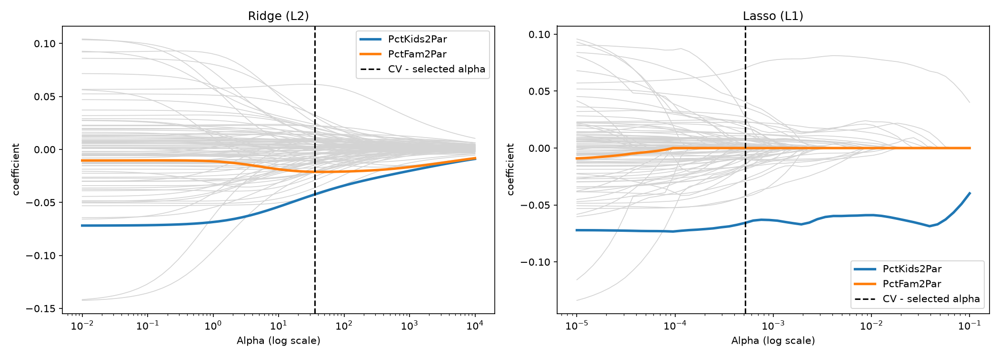
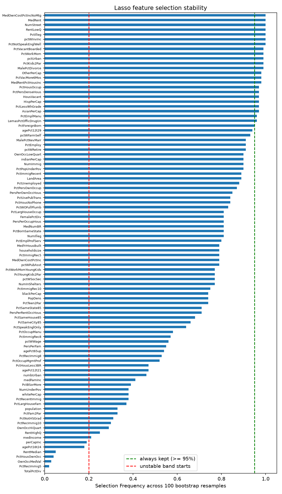

# Ridge vs Lasso under collinearity

---

*Regularization didn't improve the prediction on 96 heavily correlated features, but Lasso matched OLS with 68 of those features, and bootstrap resampling strategy showed only 24 of its selections which are stable*

---

**With 96 features which are heavily correlated to each other, does using regularization improved selection? And can Lasso's feature selection be trusted?**

---

### About Dataset:

1. **Dataset used:** UCI Communities and Crime, Redmond, M. (2002), UCI Machine Learning Repository. **License:** CC BY 4.0.
2. **Link:** https://doi.org/10.24432/C53W3X
3. Contains 1,994 communities in it.
4. **Target Variable:** ViolentCrimesPerPop.
5. **Cleaning the dataset:** Dropped 5 identifier columns, 22 Police (LEMAS) columns which were 84% missing and median-filled 1 value in OtherPerCap.
6. **The race columns:** Dropped 4 racial-composition features despite costing 1 point of test R² score, because they acts as a proxy for structural factors that the dataset already measures.

---

### Method applied:

1. **80/20 train-test split** was used for this dataset with **random_state = 42**.
2. **StandardScaler** was fitted on train dataset only.
3. **Workflow:** OLS baseline -> RidgeCV -> LassoCV -> ElasticNetCV with 5-fold cross validation over log-spaced alphas was applied.
4. Coefficient paths were measured across alpha.
5. 100 bootstrap resamples were taken at the fixed CV-chosen alpha to measure how often Lasso keeps each feature stability selection.

---

### Results:

| Model | alpha | Test R² score | Test RMSE | Non-zero coefficients |
|--|--|--|--|--|
| OLS| - | 0.6277 | 0.1335 | 96 |
| Ridge | 35.56 | 0.6256 | 0.1339 | 96 |
| Lasso | 0.00052 | 0.6297 | 0.1332 | 68 |
| ElasticNet (l1 = 0.1) | 0.0049 | 0.6286 | 0.1334 | 71 |


This figure showcases twin pair with **correlation = 0.985**, Ridge splits the weight while Lasso zeroes one.


This figure shows that 24 features are always kept, 41 features are unstable and there's no gap between the ones which are kept and dropped.

**Condition number:** 227
*50 feature pairs with correlation > 0.9*

---

### Conclusion:

1. Performing regularization didn't improve the prediction (± 0.002 R² score), with ~1,600 rows for 96 features, OLS wasn't badly overfit.
2. Collinearity did hurt the interpretability but not the accuracy.
3. A single Lasso fit's feature list isn't reliable, hence, selection frequency was reported.

---

### Limitations:

1. There exists a single train/test split so ± 0.002 differences are within the noise.
2. The features were pre-normalised, i. e, values beyond 3 SD were clipped. Hence, the coefficients aren't in their real-world units.
3. The data used here was recorded in 1990-95 so the relationships are correlated not causal.
4. Bootstrapping was done at a fixed alpha, therefore, re-tuning alpha per each resample would've added a second source of variation in the results.

---

### How to run?

1. Create and activate venv.
2. ```Run the command in the terminal:
    pip install -r requirements.txt```
3. ```Run the following commands in the following order:
    python -m src.load_data
    python -m src.preprocess
    python -m src.baseline
    python -m src.regularization
    python -m src.coefficient_paths
    python -m src.stability```

---

### Project structure:

```├── dataset/
│   ├── raw/                  # Original UCI files: communities.data, communities.names
│   └── processed/            # Cleaned dataset: communities_clean.csv, Output of preprocess.py
├── reports/
│   └── figures/              # Images: coefficient_paths.png, lasso_selection_frequency.png
├── src/
│   ├── load_data.py          # Parsed the column names and loaded the raw data
│   ├── preprocess.py         # Dropped the identifiers and high-missing columns, Imputation
│   ├── baseline.py           # train/test split, scaling, OLS baseline
│   ├── regularization.py     # RidgeCV, LassoCV, ElasticNetCV
│   ├── coefficient_paths.py  # Coefficient paths across alpha
│   └── stability.py          # Bootstrap selection-frequency experimentation
├── requirements.txt
└── README.md```

---
